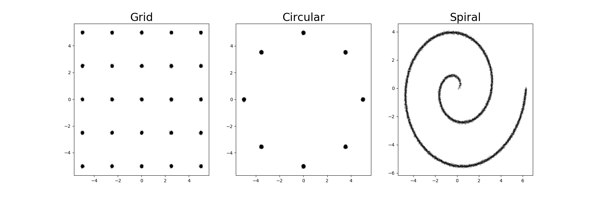
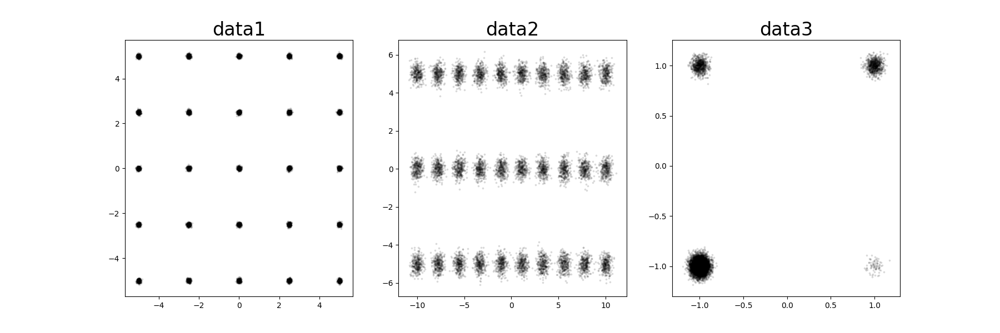
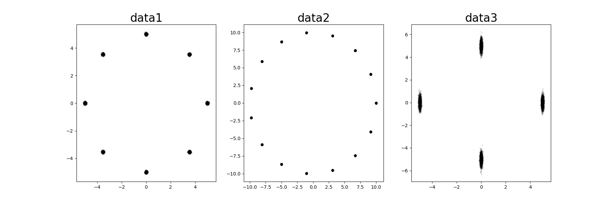
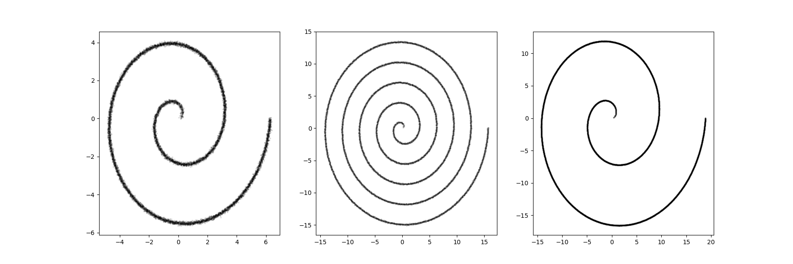

# Synthetic Datasets for Genterative Adversarial Networks
A collection of python functions to generate synethic 2D distributions. These datasets are commonly used for evaluating the degree of mode collapse and learning capabilities of GAN generators.

## Requirements:
- Python 3
- numpy



## Distributions:
### Gaussian Grid
```python
GridGaussianDataset(rows, cols grid_width, grid_height, variance, samples, sample_weights, random_state)
```

    Parameters
    ----------
    rows : int, optional (default=5)
    cols : int, optional (default=5)
        The number of rows/cols in the gaussian grid. Must be >1.
        ie. rows=cols=5 produces a grid of 25 evenly spaced 2D gaussian distibutions.

    grid_width : int, optional (default=10)
    grid_height : int, optional (default=10)
        The height/width of the data space domain centred around (0,0).
        ie. grid_width=grid_height=10 produces the grid in the domain x∈[-5,5] y∈[-5,5].

    variance : float or list of floats of length 2, optional (default=0.0025)
        The variance of the gaussian distribution.
        If given a single float then both the x and y variance will use that value.
        If given a list of floats then the x and y variance will use the first and second values respectively. 
    
    samples : int, optional (default=10000)
        The total number of samples produced.

    sample_weights : list of floats of length cols*rows or None, optional (default=None)
        The proportion of samples drawn from each gaussian in column-row order (starting with top-left distribution).
        If None then all distrubtions receive equal weighting. 

    random_state : int or None, optional (default=None)
        Determines the RNG for the data sampling. Use for reproducible outputs.
        If None then output is random each function call.

    Returns
    -------
    data : array of shape [samples, 2]
        The data points.
        
### Circular Gaussian
```python
CircularGaussianDataSet(modes, radius, variance, samples, sample_weights, random_state)
```

    Parameters
    ----------
    modes : int, optional (default=8)
        The number of distributions.

    radius : int, optional (default=5)
        The radius of the circle centred around (0,0).

    variance : float or list of floats of length 2, optional (default=0.0025)
        The variance of the gaussian distribution.
        If given a single float then both the x and y variance will use that value.
        If given a list of floats then the x and y variance will use the first and second values respectively. 
    
    samples : int, optional (default=10000)
        The total number of samples produced.

    sample_weights : list of floats of length cols*rows or None, optional (default=None)
        The proportion of samples drawn from each gaussian in counter-clockwise order (starting with the north-most distribution).
        If None then all distrubtions receive equal weighting. 

    random_state : int or None, optional (default=None)
        Determines the RNG for the data sampling. Use for reproducible outputs.
        If None then output is random each function call.

    Returns
    -------
    data : array of shape [samples, 2]
        The data points.
        
### Archimedean Spiral (Swiss Roll)
```python
ArchimedeanSpiralDataSet(revolutions, scale, variance, samples, random_state)
```
    Parameters
    ----------
    revoutions : int, optional (default=2)
        The number of revolutions of the spiral.

    scale : float, optional (default=1)
        A scaling factor to control the radius of each revolution.

    variance : float or list of floats of length 2, optional (default=0.0025)
        The variance of the gaussian distribution.
        If given a single float then both the x and y variance will use that value.
        If given a list of floats then the x and y variance will use the first and second values respectively. 
    
    samples : int, optional (default=10000)
        The total number of samples produced.

    random_state : int or None, optional (default=None)
        Determines the RNG for the data sampling. Use for reproducible outputs.
        If None then output is random each function call.

    Returns
    -------
    data : array of shape [samples, 2]
        The data points.
        
## Examples
```python
from synthetic_dataset import GridGaussianDataset
data1 = GridGaussianDataset()
data2 = GridGaussianDataset(rows=3, cols=10, variance=0.1, grid_width=20, grid_height=10)
data3 = GridGaussianDataset(rows=2, cols=2, grid_width=2, grid_height=2, sample_weights=[1,10,1,0.1])
```


```python
from synthetic_dataset import CircularGaussianDataSet
data1 = CircularGaussianDataSet()
data2 = CircularGaussianDataSet(modes=15, radius=10)
data3 = CircularGaussianDataSet(modes=4, variance=[0.0025, 0.1])
```


```python
from synthetic_dataset import ArchimedeanSpiralDataSet
data1 = ArchimedeanSpiralDataSet()
data2 = ArchimedeanSpiralDataSet(revolutions=5)
data3 = ArchimedeanSpiralDataSet(scale=3, variance=0.00025)
```


